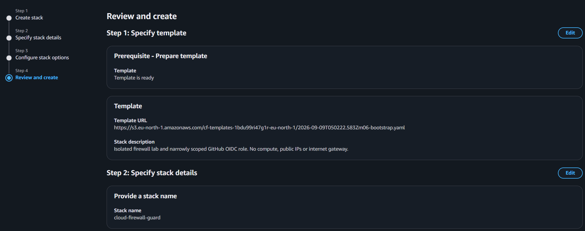
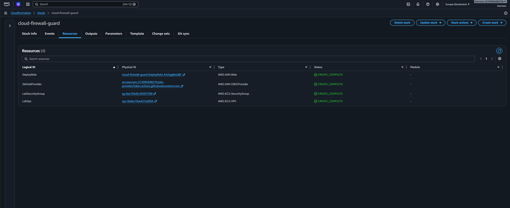
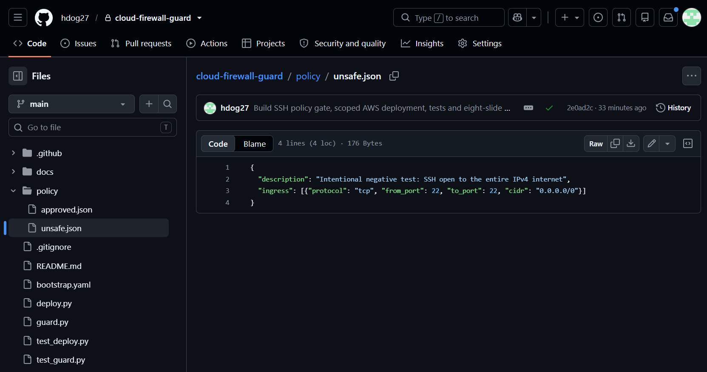
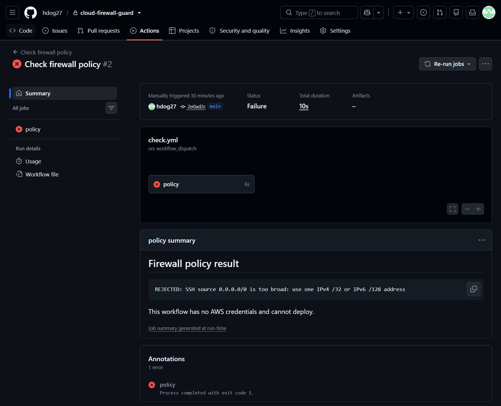
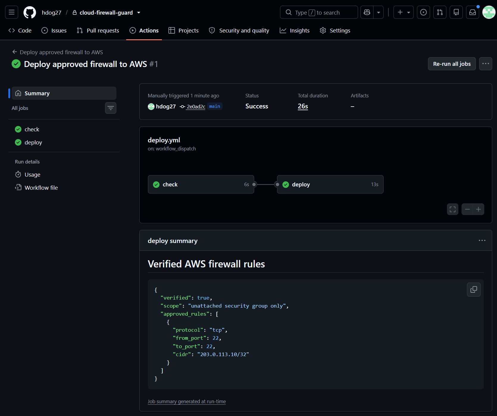

# Cloud Firewall Guard | Build Walkthrough

I built a small AWS security lab that checks firewall changes before deploying them.

The test was simple: deliberately propose an SSH rule open to the entire internet, make the pipeline reject it, correct the rule, and prove the approved version reached AWS.

[View the working code and automation](https://github.com/hdog27/cloud-firewall-guard)

## 1 | Define the lab as code

I used an AWS CloudFormation template to define the lab network, firewall group, GitHub identity connection, and limited deployment role.

## 2 | Create only the required resources

The stack created four resources: a VPC, a security group, a GitHub OIDC provider, and a deployment role.

## 3 | Connect GitHub without a stored AWS password

GitHub stores the role and firewall group identifiers as repository variables. When the workflow runs, GitHub requests a short-lived AWS access pass through OIDC. The account and resource identifiers are omitted from this public walkthrough.

## 4 | Propose an unsafe rule

The negative test uses `0.0.0.0/0`, which means any IPv4 address could attempt an SSH connection on port 22.

## 5 | Reject it before deployment

The policy check failed on purpose. This workflow has no AWS credentials, so a rejected rule cannot reach the lab.

## 6 | Deploy the approved rule

The restricted rule passed the check. GitHub then obtained temporary AWS credentials, applied the rule, and verified the result returned by AWS.

## Result

The lab demonstrates policy validation, short-lived cloud credentials, limited IAM permissions, infrastructure as code, and post-deployment verification.

No server is attached to the security group. The project tests how firewall changes are checked and deployed, rather than simulating a live attack.

